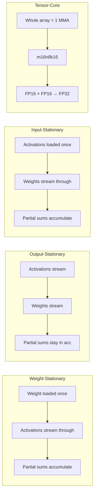
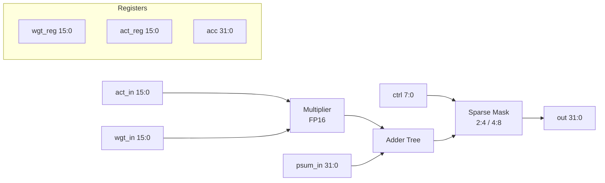
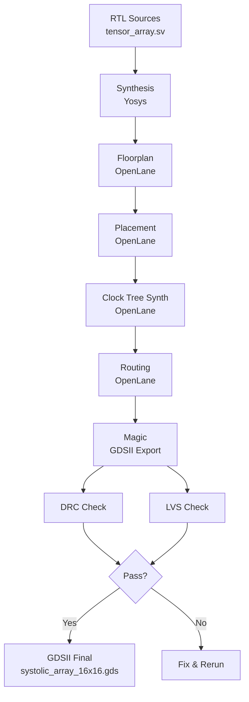

<div align="center">

# sovereign-systolic
**16×16 Systolic Array · 4-bit Tensor ISA · Microcode Controller · Tensor Core · Path to GDSII**

[](LICENSE)
[](LICENSE)
[](LICENSE)
[](rtl/)
[](synth/)
[](synth/)
[](synth/)

Sovereign hardware tensor processor: 256 processing elements, microcode-driven FSM, four dataflow modes, and a complete ASIC flow to GDSII.

</div>

---

## Architecture

```mermaid
graph TB
    subgraph "sovereign-systolic"
        MC[Microcode ROM<br/>512+ entries] --> FSM[Array Controller<br/>FSM]
        FSM -->|ctrl[7:0]| PE00[PE 0,0]
        FSM -->|ctrl[7:0]| PE01[PE 0,1]
        FSM -->|ctrl[7:0]| PE10[PE 1,0]
        FSM -->|ctrl[7:0]| PE11[PE 1,1]
        PE00 -->|psum| PE01
        PE10 -->|psum| PE11
        PE00 -->|psum| PE10
        PE01 -->|psum| PE11
    end

    ACT[Activation Stream] -->|act_in[15:0]| PE00
    ACT -->|act_in[15:0]| PE10
    WGT[Weight Stream] -->|wgt_in[15:0]| PE00
    WGT -->|wgt_in[15:0]| PE01
    PE11 -->|result| OUT[Output]
```

## Dataflow



## Processing Element



## Control Word

| Bit | Signal | Function |
|-----|--------|----------|
| 7 | `load_wgt_reg` | Latch weight (WS mode) |
| 6 | `load_act_reg` | Latch activation (IS mode) |
| 5 | `acc_en` | Enable accumulator |
| 4 | `psum_sel` | Select partial sum source |
| 3 | `sparse_en` | Structured sparsity gating |
| 2 | `pass_through` | Bypass accumulator |
| 1 | `clear_acc` | Reset accumulator |
| 0 | `output_en` | Drive output bus |

## Tape-out Files

| File | Purpose |
|------|---------|
| `tapeout/tensor_array.sdc` | SDC timing constraints (Sky130 100MHz / 7nm 800MHz) |
| `tapeout/pin_order.cfg` | OpenLane pin placement |
| `tapeout/pad_frame.md` | Bond pad description (1400µm die) |
| `tapeout/generate_gdsii.sh` | GDSII generation flow |
| `dft/dft_scan.ys` | DFT / scan insertion |

## GDSII Flow



## Performance

| Architecture | Peak (dense) | TOPS/W | Notes |
|---|---|---|---|
| NVIDIA B200 | ~4.5 PFLOPS FP8 | 1.5–2.0 | Software ecosystem |
| Google TPU v5p | ~900+ TFLOPS | 2.5–4.0 | Cloud-only |
| Cerebras WSE-3 | 100+ PFLOPS | High | On-wafer SRAM |
| **sovereign-systolic** | **~0.5–1 TOPS** | **5–10+** | **4-bit ISA native** |

## Physical (estimated, 7nm)

| Metric | Value |
|--------|-------|
| PE area | 800–1500 µm² |
| Array + controller | 0.3–0.6 mm² |
| Power (dense FP16) | 0.8–1.5 W @ 1 GHz |
| Clock target | 800 MHz – 1.2 GHz |
| Die size | 1400 × 1400 µm |
| Total pads | ~70–80 (QFN-88 / BGA-100) |

## Build

```bash
# Simulation
iverilog -g2012 -o tb_systolic rtl/*.sv tb/tb_systolic_array.sv
vvp tb_systolic

# Synthesis
cd synth && yosys -s synth_tensor_array.ys

# Physical Design
cd synth && openlane config.json

# Full GDSII Flow
bash tapeout/generate_gdsii.sh
```

---

## Topics

`hardware` `systolic-array` `tensor-core` `ASIC` `GDSII` `OpenLane` `Yosys` `Sky130` `SystemVerilog` `microcode` `tensor-processor` `FP16` `sparsity` `sovereign`

---

**Sovereign Source License v1.0 + BSL-1.1 + AGPL-3.0 (tri-license)**

Ahmad Ali Parr · Bel Esprit D'Accord Irrevocable Trust · EIN 42-697643
